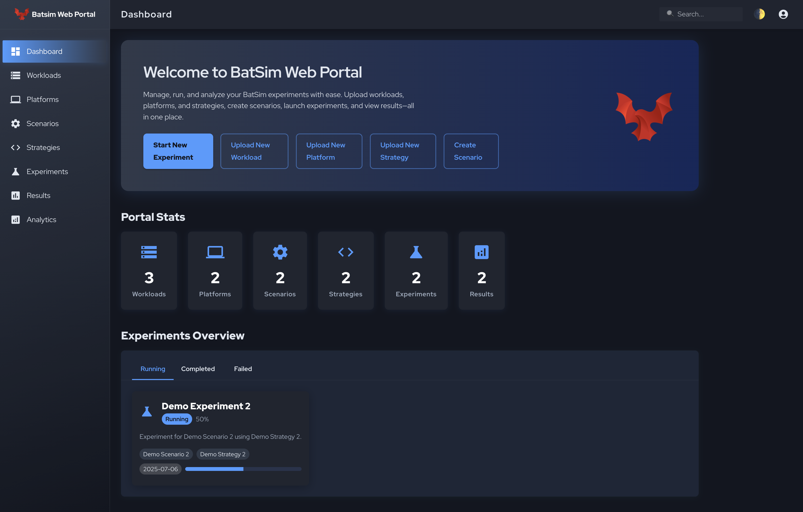

# BatSim Web Portal



A modern web portal for managing BatSim simulations with React + TypeScript frontend and FastAPI backend.

## Table of Contents

- [Features](#features)
- [Project Structure](#project-structure)
- [Implementation Status](#implementation-status)
- [Quick Start](#quick-start)
- [API Documentation](#api-documentation)
- [Technologies Used](#technologies-used)
- [Development](#development)

## Features

- **User Management**: Authentication with roles (admin, user)
- **Workload Management**: Upload, manage, and organize workload traces
- **Platform Management**: Define and manage platform descriptions
- **Scenario Management**: Combine workloads and platforms for experiments
- **Strategy Management**: Upload and manage Python scheduling strategies
- **Experiment Control**: Start, stop, pause, and monitor BatSim simulations
- **Real-time Monitoring**: Track experiment progress and system resources
- **Results Analytics**: Store and analyze simulation results with charts
- **Container Orchestration**: Automatic BatSim and PyBatsim container management

## Project Structure

```
batsim-web-portal/
├── frontend/          # React + TypeScript + Vite application
│   ├── src/
│   │   ├── components/    # Reusable UI components
│   │   ├── pages/         # Page components
│   │   ├── services/      # API services with TypeScript types
│   │   ├── store/         # Zustand state management
│   │   └── utils/         # Utility functions
│   ├── tsconfig.json      # TypeScript configuration
│   └── package.json
├── backend/           # FastAPI application
│   ├── app/
│   │   ├── api/          # API routes
│   │   ├── core/         # Core configuration
│   │   ├── models/       # SQLAlchemy models
│   │   ├── schemas/      # Pydantic schemas
│   │   ├── services/     # Business logic
│   │   └── utils/        # Utility functions
│   ├── storage/          # File storage
│   └── requirements.txt
└── README.md
```

## Implementation Status

### ✅ Completed
- **Backend**: FastAPI with SQLAlchemy models, Pydantic schemas, authentication
- **Frontend**: React + TypeScript + Material-UI with routing and authentication
- **Database**: SQLite with models for Users, Workloads, Platforms, Scenarios, Strategies, Experiments, Results
- **Authentication**: JWT-based login/register with role management
- **API**: RESTful endpoints for all entities with file upload/download
- **UI**: Modern Material-UI interface with responsive design

### 🚧 In Progress
- **Workloads Page**: CRUD operations with file upload
- **Platforms Page**: CRUD operations with file upload
- **Scenarios Page**: Create scenarios from workloads and platforms
- **Strategies Page**: Upload Python strategy files
- **Experiments Page**: Start/stop/pause experiments with container management
- **Analytics Page**: Charts and result comparison

### 📋 Planned
- **Container Orchestration**: Docker SDK integration for BatSim/PyBatsim
- **Real-time Monitoring**: WebSocket updates for experiment progress
- **System Monitoring**: CPU, RAM, disk usage tracking
- **Advanced Analytics**: Comparative analysis and trend visualization

## Quick Start

### Backend Setup
```bash
cd backend
python -m venv venv
source venv/bin/activate  # On Windows: venv\Scripts\activate
pip install -r requirements.txt
uvicorn app.main:app --reload
```

### Frontend Setup
```bash
cd frontend
npm install
npm run dev
```

## API Documentation

Once the backend is running, visit:
- Swagger UI: http://localhost:8000/docs
- ReDoc: http://localhost:8000/redoc

## Technologies Used

### Frontend
- **React 19** with TypeScript
- **Vite** for fast development and building
- **Material-UI (MUI)** for modern UI components
- **React Router** for navigation
- **Zustand** for state management
- **Axios** for API calls
- **Chart.js** for analytics (planned)

### Backend
- **FastAPI** with automatic API documentation
- **SQLAlchemy** with SQLite/PostgreSQL support
- **Pydantic** for data validation
- **Docker SDK** for container management (planned)
- **JWT** authentication
- **File upload/download** handling
- **System monitoring** with psutil (planned)

## Development

### TypeScript
The frontend is fully typed with TypeScript for better development experience:
- Strict type checking enabled
- API types generated from backend schemas
- Component props properly typed
- State management with typed stores

### Code Quality
- ESLint configuration for code quality
- Prettier for code formatting (recommended)
- TypeScript strict mode enabled
- Material-UI best practices followed 