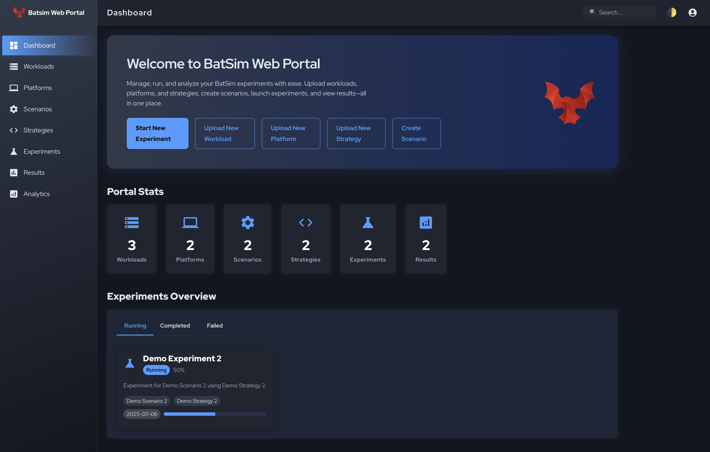

# BatSim Web Portal



A modern web portal for managing BatSim simulations with React + TypeScript frontend and FastAPI backend.

## Table of Contents

- [Features](#features)
- [Project Structure](#project-structure)
- [Status](#status)
- [Deployment and Security](#deployment-and-security)
- [Quick Start](#quick-start)
- [API Documentation](#api-documentation)
- [Technologies Used](#technologies-used)
- [Development](#development)

## Features

- **User Management**: Authentication with roles (admin, user)
- **Workload Management**: Upload, manage, and organize workload traces
- **Platform Management**: Define and manage platform descriptions
- **Scenario Management**: Combine workloads and platforms for experiments
- **Strategy Management**: Upload and manage Python scheduling strategies
- **Experiment Control**: Start, stop, pause, and monitor BatSim simulations
- **Real-time Monitoring**: Track experiment progress and system resources
- **Results Analytics**: Store and analyze simulation results with charts
- **Container Orchestration**: Automatic BatSim and PyBatsim container management

## Project Structure

```
batsim-web-portal/
├── frontend/          # React + TypeScript + Vite application
│   ├── src/
│   │   ├── components/    # Reusable UI components
│   │   ├── pages/         # Page components
│   │   ├── services/      # API services with TypeScript types
│   │   ├── store/         # Zustand state management
│   │   └── utils/         # Utility functions
│   ├── tsconfig.json      # TypeScript configuration
│   └── package.json
├── backend/           # FastAPI application
│   ├── app/
│   │   ├── api/          # API routes
│   │   ├── core/         # Core configuration
│   │   ├── models/       # SQLAlchemy models
│   │   ├── schemas/      # Pydantic schemas
│   │   ├── services/     # Business logic
│   │   └── utils/        # Utility functions
│   ├── storage/          # File storage
│   └── requirements.txt
└── README.md
```

## Status

Feature-complete and deployed for lab evaluation. All features listed above are
implemented, including container orchestration, live experiment monitoring,
system metrics and comparative analytics.

- **62 REST endpoints** across auth, workloads, platforms, scenarios, strategies,
  experiments, results and system.
- **272 backend tests** across unit, integration and e2e layers — 270 passing, with
  2 e2e tests skipped when no local Docker daemon is available. Run with `pytest`.
- Instrumented with Prometheus metrics and a provisioned Grafana dashboard.

Live experiment progress is delivered by **HTTP polling** (2 s for progress, 5 s
for log streams), not WebSockets — chosen because simulation runs are long-lived
and the update rate is low.

## Deployment and Security

**This portal is designed to run on a trusted network (lab LAN or VPN) only.**
Do not expose it directly to the public internet. Three properties make a public
deployment unsafe:

1. The backend mounts `/var/run/docker.sock` to spawn sibling BatSim/PyBatsim
   containers, which grants full control of the host Docker daemon.
2. It executes user-supplied Python scheduling strategies.
3. The default compose stack serves the frontend from the Vite dev server.

Uploaded strategies are checked before execution — imports are validated against
an allow-list by AST inspection, and dynamic-import escapes (`__import__`,
`importlib.import_module`) are rejected at upload time rather than failing
mid-simulation. This is a usability and safety guard, **not** a sandbox, and it
does not change the guidance above.

See `DEPLOY.md` for the lab VM deployment procedure.

## Quick Start

### Backend Setup
```bash
cd backend
python -m venv venv
source venv/bin/activate  # On Windows: venv\Scripts\activate
pip install -r requirements.txt
uvicorn app.main:app --reload
```

### Frontend Setup
```bash
cd frontend
npm install
npm run dev
```

## API Documentation

Once the backend is running, visit:
- Swagger UI: http://localhost:8000/docs
- ReDoc: http://localhost:8000/redoc

## Technologies Used

### Frontend
- **React 19** with TypeScript
- **Vite** for fast development and building
- **Material-UI (MUI)** for modern UI components
- **React Router** for navigation
- **Zustand** for state management
- **Axios** for API calls
- **Chart.js** for timeline, CDF and stacked-area analytics
- **Konva** for the canvas-rendered schedule Gantt and host-utilization heatmap
- **react-window** for virtualized rendering of large job lists

### Backend
- **FastAPI** with automatic API documentation
- **SQLAlchemy** with SQLite/PostgreSQL support
- **Alembic** for schema migrations
- **Pydantic** for data validation
- **Docker SDK** for BatSim/PyBatsim container orchestration
- **JWT** authentication with role management
- **File upload/download** handling
- **defusedxml** for parsing untrusted platform descriptions
- **System monitoring** with psutil, exported via **prometheus-client**
- **pytest** with coverage reporting

## Development

### TypeScript
The frontend is fully typed with TypeScript for better development experience:
- Strict type checking enabled
- API types generated from backend schemas
- Component props properly typed
- State management with typed stores

### Code Quality
- ESLint configuration for code quality
- Prettier for code formatting (recommended)
- TypeScript strict mode enabled
- Material-UI best practices followed 